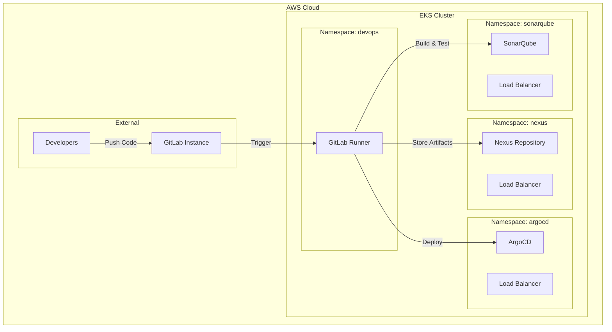

# 🚀 DevOps CI/CD Platform on Amazon EKS

[](https://opensource.org/licenses/MIT)
[](https://terraform.io)
[](https://kubernetes.io)
[](https://aws.amazon.com/eks/)

A complete DevOps platform deployed on Amazon EKS with automation scripts, integrating GitLab CI/CD, ArgoCD, SonarQube, and Nexus Repository Manager.

---

## 📋 Table of Contents

- [🌟 Overview](#-overview)
- [🗃️ Architecture](#️-architecture)
- [🛠️ Components](#️-components)
- [📋 Prerequisites](#-prerequisites)
- [⚡ Quick Installation](#-quick-installation)
- [📖 User Guide](#-user-guide)
- [🚀 CI/CD Pipeline](#-cicd-pipeline)
- [🔍 Troubleshooting](#-troubleshooting)
- [🤝 Contributing](#-contributing)

---

## 🌟 Overview

This solution provides a production-ready DevOps platform automatically deployed on Amazon EKS. It includes all essential tools for modern CI/CD workflows with an Infrastructure-as-Code approach.

### ✨ Key Features

- **🎯 Automated Deployment**: Smart shell scripts for zero-friction deployment
- **🔒 Integrated Security**: RBAC, IRSA, and secret management
- **📦 Persistent Storage**: AWS EBS CSI Driver with GP3 storage classes
- **🌐 External Access**: AWS Load Balancers with automatic configuration
- **📄 Complete CI/CD**: GitLab pipeline integrated with ArgoCD for GitOps
- **📊 Integrated Monitoring**: Centralized logs and metrics
- **🎛️ Flexible Configuration**: Customizable variables for all environments

---

## 🗃️ Architecture



### 🔧 Infrastructure Components

| Component | Version | Namespace | Ports | Storage |
|-----------|---------|-----------|-------|---------|
| **EKS Cluster** | 1.31 | - | - | - |
| **AWS Load Balancer Controller** | Latest | kube-system | - | - |
| **EBS CSI Driver** | 2.28.1 | kube-system | - | - |
| **Nexus Repository** | Latest | nexus | 8081, 5000 | 30Gi |
| **SonarQube** | Community | sonarqube | 9000 | 20Gi |
| **ArgoCD** | 5.51.6 | argocd | 8080 | - |
| **GitLab Runner** | 16.6.1 | devops | - | - |

---

## 🛠️ Components

### 📦 **Nexus Repository Manager**
- **Function**: Artifact manager and private Docker registry
- **Features**: Maven/Docker/npm repositories, private Docker registry on port 5000, 30Gi persistent storage

### 🔍 **SonarQube Community Edition**
- **Function**: Static code analysis and security
- **Features**: Code quality analysis, vulnerability detection, coverage metrics, GitLab CI integration

### 🚀 **ArgoCD**
- **Function**: GitOps deployment and continuous delivery
- **Features**: Automatic Git synchronization, web monitoring interface, automatic rollback, multi-cluster support

### 🏃 **GitLab Runner**
- **Function**: CI/CD pipeline executor
- **Features**: Kubernetes native executor, Docker-in-Docker support, auto-scaling, job isolation

---

## 📋 Prerequisites

### 🔧 Required Tools

```bash
# Check that you have all required tools installed
aws --version          # AWS CLI v2.x
kubectl version        # kubectl v1.25+
tofu --version        # OpenTofu v1.6+
helm version          # Helm v3.10+
```

### ☁️ AWS Configuration

1. **AWS Account** with administrator permissions
2. **Supported Region** (e.g., eu-west-1, us-west-2)
3. **Configured Credentials**:
```bash
aws configure
# or
export AWS_ACCESS_KEY_ID="your-access-key"
export AWS_SECRET_ACCESS_KEY="your-secret-key"
export AWS_DEFAULT_REGION="eu-west-1"
```

### 🚇 GitLab Instance

- Accessible GitLab instance (cloud or self-hosted)
- GitLab Runner registration token
- Repository for your application

---

## ⚡ Quick Installation

### 🚀 Deploy in 3 Steps

```bash
# 1. Clone the repository
git clone <your-repo-url>
cd eks-devops-platform

# 2. Configuration
cp devops-tools/devops-vars.tfvars.example devops-tools/devops-vars.tfvars
# Edit devops-vars.tfvars with your parameters

# 3. Automatic deployment
cd cluster && ./deploy-cluster.sh
cd ../devops-tools && ./deploy-devops-tools.sh
./create-loadbalancers.sh
```

**⏱️ Total time: ~20-25 minutes**

---

## 📖 User Guide

### 🔧 Initial Configuration

#### 1. **Variable Configuration**

Edit the `devops-tools/devops-vars.tfvars` file:

```hcl
# Cluster configuration
cluster_name = "devops-platform-prod"
aws_region   = "eu-west-1"

# GitLab configuration
gitlab_url                = "https://gitlab.example.com"
gitlab_registration_token = "your-gitlab-runner-token"

# Service passwords
nexus_admin_password     = "your-secure-password"
sonarqube_admin_password = "your-secure-password"
argocd_admin_password    = "your-secure-password"
```

### 🚀 Step-by-Step Deployment

#### **Step 1: EKS Cluster Deployment**

```bash
cd cluster
./deploy-cluster.sh

# Verification
kubectl get nodes
kubectl get pods --all-namespaces
```

**⏱️ Duration: 10-15 minutes**

#### **Step 2: DevOps Tools Deployment**

```bash
cd ../devops-tools
./deploy-devops-tools.sh

# Status verification
./deploy-devops-tools.sh status
```

**⏱️ Duration: 10-15 minutes**

#### **Step 3: Service Exposure**

```bash
# Install Load Balancer Controller
./install-controller-fixed.sh

# Create Load Balancers
./create-loadbalancers.sh

# Check URLs
./create-loadbalancers.sh status
```

**⏱️ Duration: 3-5 minutes**

### 🔍 Post-Deployment Verification

```bash
# Check all pods
kubectl get pods --all-namespaces

# Check services
kubectl get svc --all-namespaces | grep LoadBalancer

# Check persistent volumes
kubectl get pvc --all-namespaces
```

---

## 🚀 CI/CD Pipeline

### 📝 GitLab CI/CD Template

The project automatically generates an optimized `.gitlab-ci.yml` template:

```yaml
stages:
  - build
  - test
  - security
  - package
  - deploy

build:
  stage: build
  image: maven:3.8.6-openjdk-11
  script:
    - mvn clean compile
  artifacts:
    paths: [target/]

test:
  stage: test
  image: maven:3.8.6-openjdk-11
  script:
    - mvn test
  artifacts:
    reports:
      junit: [target/surefire-reports/TEST-*.xml]

security_scan:
  stage: security
  image: maven:3.8.6-openjdk-11
  script:
    - mvn sonar:sonar
        -Dsonar.host.url=$SONARQUBE_URL
        -Dsonar.login=$SONAR_TOKEN

package:
  stage: package
  image: docker:20.10.16
  services: [docker:20.10.16-dind]
  script:
    - docker build -t $DOCKER_REGISTRY/$CI_PROJECT_NAME:$CI_COMMIT_SHA .
    - docker push $DOCKER_REGISTRY/$CI_PROJECT_NAME:$CI_COMMIT_SHA

deploy:
  stage: deploy
  script:
    - echo "Deployed to production via ArgoCD"
  environment: production
```

### 🎯 Complete Workflow

1. **Developer Push** → GitLab Repository
2. **GitLab CI** → Triggers pipeline
3. **Build** → Maven compilation
4. **Test** → Unit tests and coverage
5. **Security** → SonarQube analysis
6. **Package** → Docker image build
7. **Store** → Push to Nexus Registry
8. **Deploy** → ArgoCD automatically synchronizes

---

## 🔍 Troubleshooting

### ⚠️ Common Issues

#### **1. EKS Cluster not accessible**

```bash
# Check kubectl configuration
kubectl config current-context

# Reconfigure if necessary
aws eks update-kubeconfig --region eu-west-1 --name devops-platform-prod
```

#### **2. GitLab Runner not working**

```bash
# Fix GitLab token
./fix-gitlab-runner.sh

# Runner logs
kubectl logs -l app=gitlab-runner -n devops -f

# Force re-registration
./activate-gitlab-runner.sh
```

#### **3. Services not accessible**

```bash
# Check Load Balancer Controller
kubectl get pods -n kube-system -l app.kubernetes.io/name=aws-load-balancer-controller

# Reinstall if necessary
./install-controller-fixed.sh
```

### 🔧 Diagnostic Scripts

```bash
# Complete diagnosis
cd devops-tools

# Global status
./deploy-devops-tools.sh status

# Load Balancer status
./create-loadbalancers.sh status

# Test services
curl -I http://your-nexus-url/
curl -I http://your-sonarqube-url/
curl -I http://your-argocd-url/
```

---

## 💰 Costs and Optimization

### 💸 AWS Cost Estimation

| Component | Type | Cost/month (eu-west-1) |
|-----------|------|----------------------|
| EKS Cluster | - | $73 |
| Worker Nodes | 3x t3.large | ~$150 |
| Load Balancers | 3x NLB | ~$50 |
| EBS Volumes | 50Gi total | ~$5 |
| **Total estimated** | - | **~$278/month** |

### 🎯 Optimizations

```bash
# Use Spot Instances
node_groups = {
  spot = {
    capacity_type  = "SPOT"
    instance_types = ["t3.medium", "t3.large"]
    min_size      = 1
    max_size      = 5
    desired_size  = 3
  }
}
```

---

## 🤝 Contributing

### 🛠️ Development

```bash
# Fork and clone
git clone https://github.com/your-username/eks-devops-platform.git
cd eks-devops-platform

# Create feature branch
git checkout -b feature/new-component

# Development and testing
./test-scripts.sh

# Commit and push
git add .
git commit -m "feat: Add new component"
git push origin feature/new-component
```

### 📝 Guidelines

1. **Scripts**: Always include colored logging messages
2. **Documentation**: Update README for new features
3. **Tests**: Test on development environment
4. **Security**: Scan configurations with `tfsec` or `checkov`

---

## 📞 Support

### 🆘 Emergency Help

1. **Deployment issues**: Check logs with `kubectl logs`
2. **Network issues**: Check AWS Security Groups
3. **Permission issues**: Check IAM roles and RBAC
4. **Storage issues**: Check EBS CSI Driver

### 📚 Additional Resources

- [EKS Documentation](https://docs.aws.amazon.com/eks/)
- [Kubernetes Documentation](https://kubernetes.io/docs/)
- [Terraform Documentation](https://www.terraform.io/docs/)
- [GitLab CI/CD Documentation](https://docs.gitlab.com/ee/ci/)

---

## 📄 License

This project is licensed under the MIT License. See the [LICENSE](LICENSE) file for details.

---

## 🙏 Acknowledgments

- **AWS** for robust cloud services
- **CNCF** for the Kubernetes ecosystem
- **GitLab** for CI/CD tools
- **SonarSource** for code analysis
- **Sonatype** for Nexus Repository

---

<div align="center">

**🚀 Ready to revolutionize your DevOps workflow? Start now!**

[](https://aws.amazon.com/)
[](https://gitlab.com/)
[](https://kubernetes.io/)

</div>
